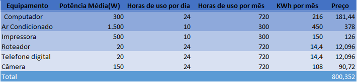

# EXCEL BÁSICO - PROJETO INTEGRADOR II - YASMIM
# PLANILHA EXCEL
1. PLANILHA DE AUXÍLO PARA AS ATIVIDADES DE FÍSICA\
  [Link de acesso à planilha](4.xlsx)
   
# IMAGENS 
2. GRÁFICOS COM RESULTADOS DA PANILHA\
   
3. IMAGEM PNG DA PLANILHA\
   
   
# SLIDE
4. SLIDE COM APLICAÇÃO DAS IMAGENS\
   [Link de acesso ao slide](5.pptx)
   
# DOCUMENTO WORD
5. DOCUMENTO WORD COM APLICAÇÃO DAS IMAGENS\
   [Link de acesso ao slide](3.docx)
